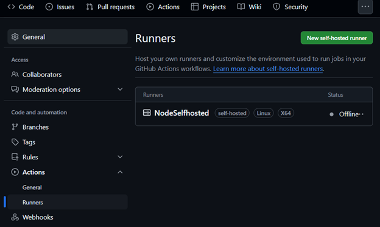

# Node.js Frontend App with Docker & GitHub Actions (Self-hosted Runner)

### Introduction  
In this project, we’ve built a simple **Node.js application** that serves only frontend files (HTML, CSS, and JavaScript). The main goal is to run this app inside a **Docker container** and build & deploy it through a **CI/CD pipeline** — but the twist is, we're using a **GitHub Actions self-hosted runner** for the process.

---

### What Is Being Done in This Project  
- A Node.js app is created that serves static frontend files.  
- A Dockerfile is created to enable containerization.  
- CI/CD steps are written in the `.github/workflows/docker-build.yml` file.  
- Demonstrated how to build and run the code locally using a GitHub self-hosted runner.  
- After running the container, the HTTP response is checked using `curl`.

---

This entire process is automated using:

🔄 **GitHub Actions Workflow** ➜ which runs on a **self-hosted runner** ➜ builds a **Docker image** ➜ runs the **container** ➜ checks the **response**.

---
## Before we get started the task, let's get to know what the Self-hosted Runner is.
## What is a Self-hosted Runner?

A **self-hosted runner** is a customizable version of GitHub Actions' runner that executes workflows on your own machine or server, unlike GitHub's default **hosted runners**, which run on GitHub's cloud infrastructure.

### How It Works:
1. You push code to your GitHub repository.
2. The GitHub Actions workflow is triggered.
3. Instead of running on GitHub's servers, the workflow is sent to your configured self-hosted runner.
4. The runner executes the defined tasks (e.g., building a Docker image, running a container).

### ✨ Benefits of Self-hosted Runners:
| Benefit | Description |
|---------|-------------|
| **Custom Environment** | Run workflows on your local machine, cloud VM, or internal server. |
| **Speed** | Faster execution compared to shared hosted runners. |
| **Control** | Full access to logs, debugging, and environment configuration. |
| **No Billing Limits** | Avoid GitHub's usage limits for hosted runners. |

---

## Project Structure

The project follows a clean and minimal folder structure:

```
Nodejs-app-frontend/
├── public/                # Static frontend files
│   ├── index.html         # Main HTML file
│   ├── style.css          # CSS for styling
│   └── script.js          # JavaScript for interactivity
├── server.js              # Express.js server
├── Dockerfile             # Docker configuration
├── package-lock.json      # Node.js dependencies and scripts
└── .github/workflows/     # GitHub Actions workflow
    └── docker-build.yml   # CI/CD pipeline configuration
```

---

## Project Workflow Diagram:


---

## The project follows a series of well-defined steps to achieve its goals. Below is a step-by-step breakdown of the process:

### Step 1: Initialize the Node.js Project

Create a new directory and initialize a Node.js project:

```bash
mkdir Nodejs-app-frontend
cd Nodejs-app-frontend
npm init -y
```


Install the required dependency (`express`):

```bash
npm install express
```

### Step 2: Create the some necessary files: 
 1. **`server.js`:-** The Express.js server serves static files from the `public` directory and listens on port `3000` (or a custom port defined by the environment).
 2. **Build the Frontend :-** The frontend consists of simple HTML, CSS, and JavaScript files stored in the `public` directory.
   - **`public/index.html`**
   - **`public/style.css`**
   - **`public/script.js`**
 3. **`Dockerfile` (Containerize with Docker) :-** The `Dockerfile` defines how the application is packaged into a Docker container.

```dockerfile
# Dockerfile
FROM node:18-slim
WORKDIR /app
COPY package*.json ./
RUN npm install
COPY . .
EXPOSE 3000
CMD ["node", "server.js"]
```

This Dockerfile:
- Uses the lightweight `node:18-slim` base image.
- Sets up a working directory (`/app`).
- Installs dependencies.
- Copies the application code.
- Exposes port `3000`.
- Runs the server with `node server.js`.

 5. **`docker-build.yml` (Configure GitHub Actions Workflow) :-** This workflow, named **Docker Build with Self-hosted Runner**, automates the process of building, running, and verifying a Dockerized Node.js frontend application using a **self-hosted runner**. It is triggered whenever code is pushed to the `main` branch.

```yaml
name: Docker Build with Self-hosted Runner

on:
  push:
    branches:
      - main

jobs:
  build:
    runs-on: self-hosted

    steps:
    - name: Checkout code
      uses: actions/checkout@v3

    - name: Build Docker image
      run: docker build -t frontend-only-app .

    - name: Run container
      run: docker run -d -p 3006:3000 --name frontend-app frontend-only-app

    - name: Wait for app (max 10 tries)
      run: |
        for i in {1..10}; do
          code=$(curl -s -o /dev/null -w "%{http_code}" http://localhost:3006 || echo 000)
          [ "$code" = "200" ] && echo "App OK and returned HTTP 200!" && exit 0
          echo "Try $i: Got $code. Retrying..." && sleep 3
        done
        echo "App did not respond with 200." && docker logs frontend-app && exit 1

    - name: Show logs if failed
      if: failure()
      run: docker logs frontend-app

    - name: Clean up
      run: docker rm -f frontend-app
```

Here's what the workflow does:

1. **Checks out code** – Gets the latest code from GitHub.  
2. **Builds image** – Creates a Docker image named `frontend-only-app`.  
3. **Runs container** – Starts the app in a Docker container (port 3006 → 3000).  
4. **Checks response** – Tries up to 10 times to get a `200 OK` from the app.  
5. **Shows logs if failed** – If the app doesn't respond, shows container logs.  
6. **Cleans up** – Stops and removes the container after testing.  

---
### Detailed Breakdown of the YAML

```yaml
name: Docker Build with Self-hosted Runner
```

- **Purpose**: Names the workflow.

```yaml
on:
  push:
    branches:
      - main
```

- **Purpose**: Triggers the workflow on code push to the main branch.

```yaml
jobs:
  build:
    runs-on: self-hosted
```

- **Purpose**: Defines a job named `build` that runs on a **self-hosted runner**, meaning the workflow executes on a custom machine or server configured by the user.

```yaml
steps:
  - name: Checkout code
    uses: actions/checkout@v3
```

- **Purpose**: Pulls code from the GitHub repository.

```yaml
  - name: Build Docker image
    run: docker build -t frontend-only-app .
```

- **Purpose**: Builds a Docker image from the `Dockerfile`.

```yaml
  - name: Run container
    run: docker run -d -p 3006:3000 --name frontend-app frontend-only-app
```

- **Purpose**: Runs the Docker container `frontend-app` in detached mode (`-d`), maps port `3006` on the host to port `3000` in the container.

```yaml
  - name: Wait for app (max 10 tries)
    run: |
      for i in {1..10}; do
        code=$(curl -s -o /dev/null -w "%{http_code}" http://localhost:3006 || echo 000)
        [ "$code" = "200" ] && echo "App OK and returned HTTP 200!" && exit 0
        echo "Try $i: Got $code. Retrying..." && sleep 3
      done
      echo "App did not respond with 200." && docker logs frontend-app && exit 1
```

- **Purpose**: Polls the application at `http://localhost:3006` up to 10 times, waiting 3 seconds between attempts. It checks for an HTTP `200 OK` response to confirm the app is running. If successful, it prints a success message and exits with code `0`. If all attempts fail, it prints an error, shows the container logs for debugging, and exits with code `1` (indicating failure).

```yaml
  - name: Show logs if failed
    if: failure()
    run: docker logs frontend-app
```

- **Purpose**: Runs only if the previous step fails (using the `if: failure()` condition). It outputs the container logs to help diagnose why the application didn’t return a `200` status.

```yaml
  - name: Clean up
    run: docker rm -f frontend-app
```

- **Purpose**: Removes the container to keep the environment clean.
---

###  Why This Workflow Is Useful

- **Automated CI/CD**: Builds, runs, and tests the app automatically.  
- **Self-hosted Speed**: Runs faster and with more control on your own machine.  
- **App Check**: Confirms the app is working with HTTP `200 OK`.  
- **Debug-Friendly**: Shows logs if something goes wrong.  
- **Clean Runs**: Removes old containers to avoid conflicts.  


### Step 3: Set Up a Self-hosted Runner

To use a self-hosted runner, configure it on your local machine or server:

1. Go to your GitHub repository → **Settings** → **Actions** → **Runners** → **New self-hosted runner**.
2. Follow the instructions provided by GitHub to download and configure the runner. Example commands:

```bash
mkdir actions-runner && cd actions-runner
curl -o actions-runner-linux-x64-2.310.2.tar.gz -L https://github.com/actions/runner/releases/download/v2.310.2/actions-runner-linux-x64-2.310.2.tar.gz
tar xzf ./actions-runner-linux-x64-2.310.2.tar.gz
./config.sh --url https://github.com/your-username/your-repo --token YOUR_GENERATED_TOKEN
./run.sh
```
Expected Outputs: 




Here, 'NodeSelfhosted' is the selfhosted runner. This sets up the runner to listen for GitHub Actions jobs.

### Step 4: Push Code to GitHub

Initialize a Git repository, add files, and push to GitHub:

```bash
git init
git remote add origin https://github.com/your-username/node-frontend-app.git
git add .
git commit -m "Initial commit"
git push -u origin main
```

Pushing to the `main` branch triggers the GitHub Actions workflow.

### Step 5: Verify the Deployment

Once the workflow completes, the Docker container runs on the self-hosted runner. Verify the application is working by checking the HTTP response:


A `200 OK` status confirms that:
- The Docker container is running.
- The Express server is serving static files.
- The CI/CD pipeline executed successfully.

---


## 🏁 Conclusion

This project demonstrates a complete **DevOps workflow** for a simple Node.js frontend application. Key achievements include:
- Building a lightweight **Express.js server** to serve static files.
- Containerizing the app with **Docker**.
- Automating the build and deployment process using **GitHub Actions**.
- Running the CI/CD pipeline on a **self-hosted runner** for greater control.
- Verifying the deployment with `curl` to ensure a `200 OK` response.

The project serves as a foundation for scalable, production-ready applications and showcases the power of combining **Docker**, **GitHub Actions**, and **self-hosted runners** for modern DevOps workflows.

🚀 **Happy DevOps-ing!**


